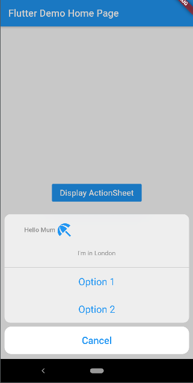
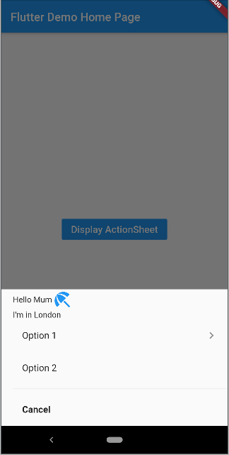

# Platform action sheet

This package is a simple platform specific actionSheet for Cupertino and Android with the following options:
- Text - *(Required)* String to display
- onPressed - *(Required)* Function to be executed on the option item being pressed
- hasArrow - Not visible on IOS, indicating more options will appear
- isCancel
- defaultAction


## Getting started
In the pubspec.yaml of your flutter project, add the following dependency:

```dart
dependencies:
  ...
  platform_action_sheet: ^0.0.1
```
In your library add the following import:
```dart
import 'package:platform_action_sheet/platform_action_sheet.dart';
```
For help getting started with Flutter, view the [online documentation](https://flutter.io/).

## Example



```dart
import 'package:flutter/material.dart';
import 'package:platform_action_sheet/platform_action_sheet.dart';

void main() => runApp(MyApp());

class MyApp extends StatelessWidget {
  @override
  Widget build(BuildContext context) {
    return MaterialApp(
      title: 'Example App',
      home: new Home(),
    );
  }
}

class Home extends StatelessWidget {
  const Home({
    Key key,
  }) : super(key: key);

  @override
  Widget build(BuildContext context) {
    return Scaffold(
      appBar: AppBar(
        title: Text('Example App'),
      ),
      body: Center(
        child: FlatButton(
          color: Colors.blue,
          onPressed: () => PlatformActionSheet().displaySheet(
          context, 
          [
            ActionSheetAction(
              text: "Option 1",
              onPressed: () => Navigator.pop(context),
              hasArrow: true,
            ),
            ActionSheetAction(
              text: "Option 2",
              onPressed: () => Navigator.pop(context),
            ),
            ActionSheetAction(
              text: "Cancel",
              onPressed: () => Navigator.pop(context),
              isCancel: true,
              defaultAction: true,
            )
          ]),
          child: Text(
            'Display ActionSheet',
            textScaleFactor: 1.2,
            style: TextStyle(color: Colors.white),
          ),
        ),
      ),
    );
  }
}
```